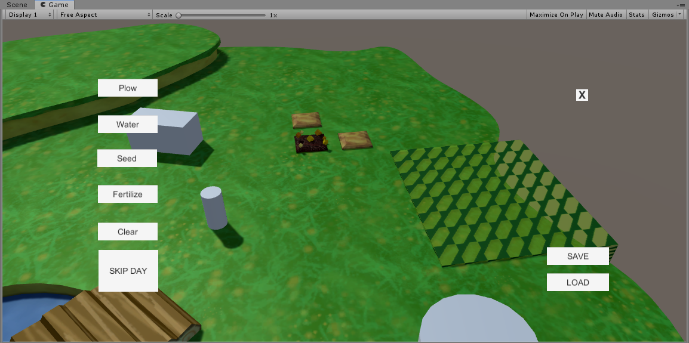
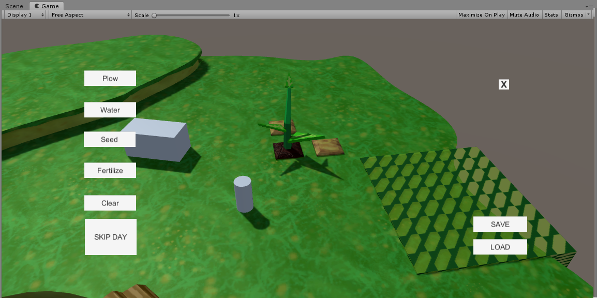
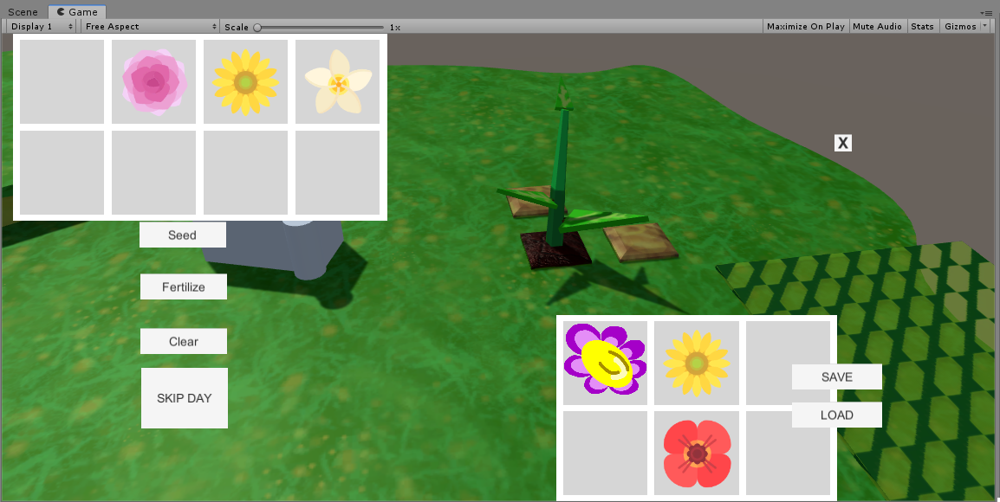
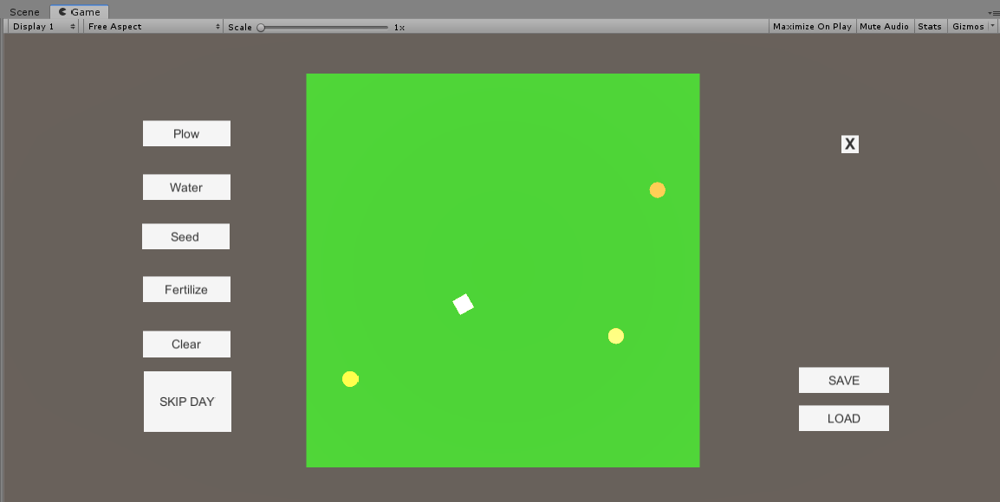
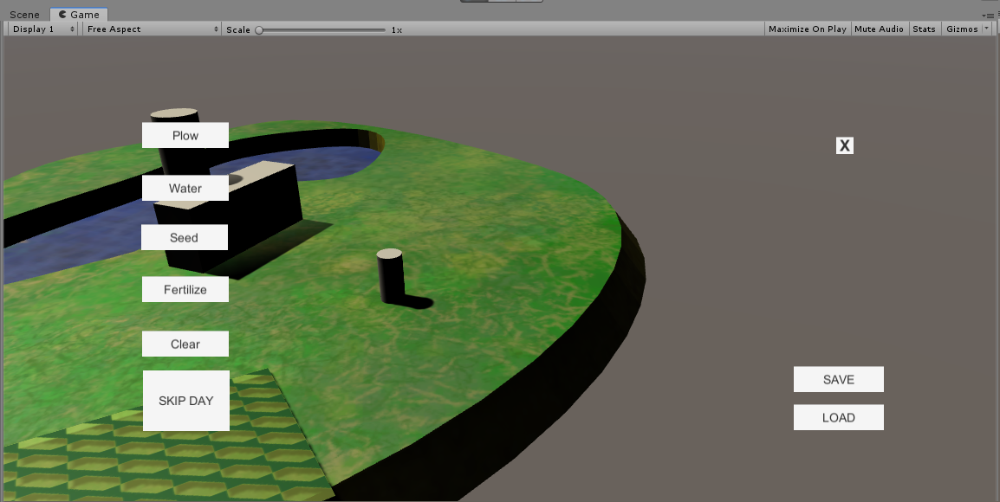

# Magic-the-gardening game

This is a **technical demo** of farmer-like game. This demo was propesed to work out such mechanisms, as:

* Interaction with scene objects and proper reaction with them (for example: plow/fertilize/water/seed ground, pick up plants, open chest/boiler, trade with salesman)
* Change of days, to make plant growing
* Different kinds of ground, that influence on plant vegetation cycle
* Drag-n-drop change interface between player and chest/salesman/boiler
* Ability to make potions in boiler, when player puts proper ingridients(plants)
* Global worldmap to travel between different locations
* Global map partition with different speed of motion (in perspective with other different properties, i.e random accounts, chance of meeting an enemy and so on)

# Demo screenshots

